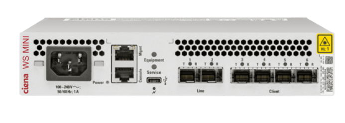

# Waveserver Mini — High-Level Design Document

## Carleton SCESoc x Ciena Coding Challenge 2026

**Version:** 3.0 (Draft)

**Date:** March 17, 2026

**Authors:** Andy Tran

**Challenge Date:** March 26, 2026

---

## Table of Contents

1. [Introduction](#1-introduction)
2. [Background: What is OTN?](#2-background-what-is-otn)
3. [System Overview](#3-system-overview)
4. [Microservice Descriptions](#4-microservice-descriptions)
5. [Interaction Flows](#5-interaction-flows)
6. [Logging](#6-logging)
7. [Challenge Structure](#7-challenge-structure)
8. [Build & Run Instructions](#8-build--run-instructions)
9. [Glossary](#9-glossary)

---

## 1. Introduction

### 1.1 The Scenario

Congratulations! You and your team have just been hired at **Ciena** — one of the
world's leading optical networking companies. Welcome aboard!

Here's the thing: you've all been assigned to the **Waveserver Mini** team. It's a
brand-new product, and the launch deadline is... *checks calendar* ... **4 hours
from now.** No pressure.


*The Waveserver Mini has two line ports (Ports 1–2) facing the optical network and
four client ports (Ports 3–6) facing customer equipment. These ports are explained
in detail in [Section 2](#2-background-what-is-otn).*

The skeleton code compiles and runs, but it's riddled with bugs and missing features.
Your team needs to squash the bugs, implement the missing pieces, and ship this
thing before the deadline. Your manager (us) has filed a bunch of GitHub Issues
describing what's broken and what's missing — your job is to divide the work, fix
the code, and get Waveserver Mini to **GA** (General Availability).

You've got this!

### 1.2 What Even Is This Thing?

Waveserver Mini is a simplified **OTN router simulator** written in C for Linux.
It's modeled after Ciena's real Waveserver platform — an optical networking product
that moves data through fiber optic cables using light — but stripped down to its
core concepts so you can understand, debug, and extend it with introductory C
programming knowledge.

The system is made up of 4 microservices that talk to each other over UDP sockets:
- **Port Manager** — manages the physical ports on the router
- **Connection Manager** — links client ports to line ports
- **Traffic Manager** — generates and forwards simulated network traffic
- **CLI** — the command-line interface where you (the network admin) type commands

### 1.3 What You Will Learn

- **Microservice architecture**: Multiple processes communicating over a network
- **Inter-process communication**: Using UDP sockets in C
- **Optical networking basics**: Client/line ports, connections, OTN frames
- **Software engineering practices**: Logging, scheduled tasks, validation, debugging
- **Collaboration tools**: GitHub Issues, Kanban boards, version control

### 1.4 Constraints

| Constraint         | Decision                                          |
|--------------------|---------------------------------------------------|
| Language           | C (This challenge was implemented with C17/18)    |
| Platform           | Linux (WSL for Windows users, native for Mac)     |
| IPC mechanism      | UDP sockets (localhost only)                      |
| External libraries | None — standard C library only (libc)             |

---

## 2. Background: What is OTN?

### 2.1 The Big Picture

Optical Transport Network (OTN) is a technology for moving large amounts of data
through fiber optic cables using light. A piece of network equipment (like Ciena's
Waveserver) has **ports** where fiber cables plug in, and software that decides how
data moves between those ports.

In Waveserver Mini, up to **4 client devices** connect to the router via **client
ports**. The traffic from those clients is **multiplexed** (combined) and sent out
through **line ports** into the optical network beyond.

```
 CLIENT DEVICES                           WAVESERVER MINI
                                       
 Device A ----------------> [Client Port 3] ──┐      ┌── [Line Port 1]
 Device B ----------------> [Client Port 4] ──┤      │   (multiplexed)
                                              ├──────┤
 Device C ----------------> [Client Port 5] ──┤      └── [Line Port 2]
 Device D ----------------> [Client Port 6] ──┘          (multiplexed)
```

**Think of it like a post office.** On one side, townspeople (client devices) drop
off letters through individual doors (client ports). On the other side, loading
docks (line ports) bundle letters from multiple doors onto the same truck
(multiplexing) and ship them out. Each door handles one person at a time, but each
dock can serve multiple doors.

### 2.2 Client Ports and Line Ports

**Client ports** face the customer's equipment. Each client port carries one signal
and can only be part of **one connection**.

**Line ports** face the fiber optic network. Each line port can carry **multiple
client connections** at once — this is called **multiplexing**, combining multiple
client signals onto a single outgoing fiber.

```
 LINE SIDE                              CLIENT SIDE
 ┌──────────────┐            ┌───────────────┐
 │  Line Port 1 │ <───────   │ Client Port 3 │  (1 connection)
 │              │            └───────────────┘
 │ (multiplexes │
 │  multiple    │            ┌───────────────┐
 │  clients)    │ <───────   │ Client Port 4 │  (1 connection)
 │              │            └───────────────┘
 └──────────────┘
```

In Waveserver Mini:
- **Ports 1–2** are line ports (can accept multiple connections)
- **Ports 3–6** are client ports (1 connection each)
- Connections always go **client → line** (never client→client or line→line)

### 2.3 Connections

A connection links a client port to a line port. When you create a connection,
traffic flows from that client port to the network through the line port.

Example — connecting all 4 client ports:
```
 Client Port 3 ──────> Line Port 1
 Client Port 4 ──────> Line Port 1
 Client Port 5 ──────> Line Port 2
 Client Port 6 ──────> Line Port 2

 Line Port 1:  2 connections (Client-3, Client-4)
 Line Port 2:  2 connections (Client-5, Client-6)
```

**Rules:**
- A client port can only have **one** connection
- A line port can accept **multiple** client connections
- Total system capacity: **4 connections** (limited by the 4 client ports, each
  can only have one connection)

**Note:** In real optical networks, connections are **bidirectional** — traffic flows
both ways (client → line *and* line → client). In Waveserver Mini, connections are
**one-way** (client → line only) to keep things simple.

### 2.4 What Does Router Software Actually Do?

At a high level, the software running on an optical router:
1. **Manages ports** — tracks which physical ports are plugged in, enabled, and healthy
2. **Manages connections** — lets a network admin create cross-connects between client and line ports
3. **Forwards traffic** — moves data frames from source to destination based on connections
4. **Monitors health** — checks port status, counts packets, raises alarms when things break
5. **Provides a CLI** — gives the network admin a way to configure and query the system

Waveserver Mini implements all five of these in a simplified form.

---

## 3. System Overview

### 3.1 Architecture Diagram

```
 ┌───────────────────────────────────────────────────────────────────────────┐
 │                        Waveserver Mini Router Simulator                   │
 └───────────────────────────────────────────────────────────────────────────┘

      ┌────────────────────────────────────────────────────────────┐
      │                    CLI (Management Console)                │
      │                                                            │
      │  User commands:                                            │
      │   > show ports               > create connection xc-1 1 3  │
      │   > show connections         > delete connection <name>    │
      │   > show traffic-stats       > set port <id>               │
      │   > show logs                etc.                          │
      └──────┬──────────────────────┬───────────────────┬──────────┘
             │ UDP                  │ UDP               │ UDP
             │ query/config         │ query/config      │ query
             v                      v                   v
 ┌───────────────────┐  ┌──────────────────────┐  ┌─────────────────────┐
 │   Port Manager    │  │  Connection Manager  │  │  Traffic Manager    │
 │   UDP Port 5001   │  │    UDP Port 5002     │  │    UDP Port 5003    │
 │                   │  │                      │  │                     │
 │ • Port inventory  │  │ • Connection table   │  │ • Simulates traffic │
 │ • Port states     │  │   (client->line)     │  │   from client to    │
 │ • PM counters     │  │ • Validates new      │  │   line              │
 │ • Health check    │  │   connections        │  │                     │
 │   cron job        │  │ • Reacts to port     │  │                     │
 │                   │  │   failures           │  │                     │
 └─────────┬─────────┘  └──────────^───┬───────┘  └───────^─────────────┘
           │                       │   │                  │
           │  Notification:        │   │  Query:          │
           │  "Port went down!"    │   │  connection      │
           └───────────────────────┘   │  table lookup    │
                                       └──────────────────┘
```

*Only two inter-service flows are shown above. See [Section 3.2](#32-communication-summary)
for the full list of all service-to-service communication.*

### 3.2 Communication Summary

| Sender         | Receiver       | Purpose                          | Pattern            |
|----------------|----------------|----------------------------------|--------------------|
| CLI            | Port Manager   | Query/configure ports            | Request → Reply    |
| CLI            | Conn Manager   | Create/delete/query connections  | Request → Reply    |
| CLI            | Traffic Mgr    | Query traffic statistics         | Request → Reply    |
| Conn Manager   | Port Manager   | Validate port state              | Request → Reply    |
| Traffic Mgr    | Conn Manager   | Route lookup for frame forwarding| Request → Reply    |
| Traffic Mgr    | Port Manager   | Update packet counters           | Fire-and-forget    |
| Port Manager   | Conn Manager   | Port-down/port-up notifications  | Fire-and-forget    |

---

## 4. Microservice Descriptions

### 4.1 Port Manager (port_manager.c) — UDP Port 5001

**Role:** Owns the physical port inventory. Tracks which ports are up, down, enabled,
or disabled. Maintains per-port performance monitoring counters.

Example port table (after enabling ports 1, 3, 4 and injecting a fault on port 3):

```
 Port  Type    Admin State  Operational State  Fault   Rx Frames  Dropped
 ────  ──────  ───────────  ─────────────────  ──────  ─────────  ───────
  1    line    enabled      up                 no        150        0
  2    line    disabled     down               no          0        0
  3    client  enabled      down               yes        34        8
  4    client  enabled      up                 no         71        0
  5    client  disabled     down               no          0        0
  6    client  disabled     down               no          0        0
```

**Key concept: Operational state is derived, never written directly.** No command
sets operational state directly — instead, each command sets its own flag (`admin_enabled` or
`fault_active`), and then `recalculate_oper_state()` derives the operational state
from those two flags. A port can safely carry traffic only when it is **admin-enabled**
and has **no active fault** — if either condition fails, the port should be operationally DOWN.

Look at Port 3 in the table above: admin is *enabled* but there's a fault, so
operational state is *down*. Clear the fault and it comes back up automatically.

**Responsibilities:**
- Maintain an array of 6 ports:
  - Ports 1–2: **line** ports (face the fiber network)
  - Ports 3–6: **client** ports (face customer equipment)
- All ports initialized as **admin-state disabled** (operator must explicitly enable via CLI with `set port <port-id>` command)
- Handle admin state changes (`set port` → admin_enable = true, `delete port` → admin_enable = false)
- Handle fault injection (`inject-fault` → fault_active = true, `clear-fault` → fault_active = false)
- **Operational state is always derived:** No command directly writes operational state — each
    command sets its own flag, then `recalculate_oper_state()` derives the result based on
    whether the port is safe to carry traffic
- When operational state changes, send a `MSG_PORT_STATE_CHANGE` notification to Connection Manager
- Accept counter update messages from Traffic Manager (increment received frames and dropped frames)
- **Cron job**: Every 5 seconds, log the health status of all ports and increment uptime

**Data Owned:**
- `port_t ports[6]` — the port inventory (4 client + 2 line)

**Does NOT do:**
- Does not know about connections (that's Connection Manager's job)
- Does not forward traffic (that's Traffic Manager's job)

---

### 4.2 Connection Manager (conn_manager.c) — UDP Port 5002

**Role:** Manages the cross-connect table. Links client ports to line ports
and validates that connections are legal.

**Responsibilities:**
- Create connections: validate, store in connection table
- Delete connections: remove from table, free the client port
- Provide route lookups to Traffic Manager (given a client port, return the connected
  line port and connection state)
- When notified of a port going down, mark all affected connections as DOWN
- When notified of a port coming back up, mark affected connections as UP

**Validation Rules (on create):**
1. One port must be a client port (3–6), the other must be a line port (1–2)
2. Operational state for both client and line port must be up.
3. The client port must not already be in a connection
4. Connection names must be unique and between 1 - 31 characters


**Data Owned:**
- `conn_t conns[MAX_CONNS]` — the connection table holds up to 4 connections. Each
  entry stores a connection name, client port, line port, and operational state. An
  entry with `client_port == 0` means no connection exists in that position — it's
  available for a new `create connection` command.

Example connection table (after creating 3 connections, then port 1 goes down):

```
 Name   Client  Line  Operational State
 ─────  ──────  ────  ─────────────────
 xc-1      3      1   DOWN
 xc-2      4      1   DOWN
 xc-3      5      2   UP
```

Port 1 has a fault, so both connections using Line Port 1 (xc-1, xc-2) are marked
DOWN. Connection xc-3 uses Line Port 2 which is healthy, so it stays UP.

**Does NOT do:**
- Does not manage port state (that's Port Manager's job)
- Does not forward traffic (that's Traffic Manager's job)

---

### 4.3 Traffic Manager (traffic_manager.c) — UDP Port 5003

**Role:** Generates simulated OTN frames, looks up the connection table 
to determine where to forward them, and keeps traffic counters.

**Responsibilities:**
- **Cron job**: Generate an OTN frame every 3 seconds
  - Traffic generation starts **stopped** — operator must issue `start traffic` via CLI to bring traffic UP.
  - `start traffic --client <id> --line <id>` pins otn frames to the specified client and line ports
  - If `--client` is omitted, a random client port (3–6) is chosen each frame
  - If `--line` is omitted, a random line port (1–2) is chosen each frame
  - Both flags may be omitted for fully random traffic
  - Assign sequential frame IDs for traceability
- For each frame, query Connection Manager for a route lookup
  - If a valid UP connection exists for that client port → FORWARD (log it, update counters)
  - If the connection is DOWN → DROP (log it, update drop counters)
  - If no connection exists → DROP (log it, update drop counters)
- Send counter updates to Port Manager after each frame decision
- Track overall traffic statistics (total forwarded, total dropped)

**Data Owned:**
- `traffic_stats_t stats` — aggregate traffic counters
- `uint32_t next_frame_id` — monotonically increasing frame ID counter

**Does NOT do:**
- Does not manage ports or connections
- Does not decide routing policy — it just follows the connection table

---

### 4.4 CLI / Management Console (cli.c) — UDP Port 5004

**Role:** The user-facing interface. Provides an interactive menu for the network
administrator to configure and monitor the router.

**Responsibilities:**
- Display a prompt and accept user commands
- Parse commands and send UDP requests to the appropriate service
- Wait for responses and display results in a formatted table
- Read and display the shared log file

**This is the only process with direct user interaction.** The other three services
run headlessly in separate terminal windows.

```
Waveserver Mini CLI — Command Reference
═══════════════════════════════════════════════════════════════

  show ports                                     Show all port states and counters
  show connections                               Show the connection table
  show traffic-stats                             Show traffic statistics
  show logs [--level LEVEL] [--service SVC]      Display the log file (optional filters)

  set port <id>                                  Enable a port (sets admin_enabled=true)
  delete port <id>                               Disable a port (sets admin_enabled=false)

  create connection <name> <port-a> <port-b>     Create a named connection
                                                 name: user-defined
                                                 one port must be line (1–2), other client (3–6)
                                                 either order is accepted

  delete connection <name>                       Delete a connection by name

  inject-fault <port-id>                         Simulate a signal loss (sets fault_active=true)
  clear-fault <port-id>                          Clear a simulated fault (sets fault_active=false)

  start traffic [--client <id>] [--line <id>]    Start frame generation (omit flags for random ports)
  stop traffic                                   Stop frame generation

  help                                           Show this help message
  exit                                           Quit the CLI
```

**Example CLI Session:**

```
wsmini> show ports

 Port  Type    Admin     Oper      Pkts In    Pkts Out   Pkts Drop
 ────  ──────  ────────  ────────  ─────────  ─────────  ─────────
  1    line    enabled   up           1500       1500          0
  2    line    enabled   up              0          0          0
  3    client  enabled   up           1204       1198          0
  4    client  enabled   up            302        299          0
  5    client  enabled   up              0          0          0
  6    client  disabled  down            0          0          0

wsmini> show connections

 Name     Client  Line  State
 ───────  ──────  ────  ──────
 xc-1       3      1    UP
 xc-2       4      1    UP

wsmini> create connection xc-3 2 5
[OK] Connection xc-3 created: Client-5 → Line-2

wsmini> create connection xc-4 5 2
[OK] Connection xc-4 created: Client-5 → Line-2
[ERROR] Client Port-5 already has a connection (xc-3)

wsmini> set port 6
[OK] Port-6 enabled

wsmini> create connection xc-4 6 1
[OK] Connection xc-4 created: Client-6 → Line-1

wsmini> delete port 6
[OK] Port-6 disabled

wsmini> inject-fault 1
[OK] Fault injected on Port-1 (line)

wsmini> show connections

 Name     Client  Line  State
 ───────  ──────  ────  ──────
 xc-1       3      1    DOWN
 xc-2       4      1    DOWN
 xc-3       5      2    UP
 xc-4       6      1    DOWN

wsmini> start traffic
[OK] Traffic started

wsmini> stop traffic
[OK] Traffic stopped

wsmini> show traffic-stats
  Total frames forwarded: 2
  Total frames dropped:   5
  Traffic is UP

wsmini> show logs --level INFO
 [26-03-24 22:37:46] [INFO] [port_mgr] [port_manager.c:115] Updated counters for port_idx=0: rx=1 dropped=0

```

---

## 5. Interaction Flows

### 5.1 Create a Connection

```
CLI                     Connection Manager               Port Manager
 │                             │                               │
 │  MSG_CREATE_CONN            │                               │
 │  {name="xc-1",              │                               │
 │   line=1, client=3}         │                               │
 │────────────────────────────►│                               │
 │                             │                               │
 │                             │  MSG_GET_PORT_INFO            │
 │                             │  {port_id=3}                  │
 │                             │──────────────────────────────►│
 │                             │◄──────────────────────────────│
 │                             │                               │
 │                             │  MSG_GET_PORT_INFO            │
 │                             │  {port_id=1}                  │
 │                             │──────────────────────────────►│
 │                             │◄──────────────────────────────│
 │                             │                               │
 │                             │  VALIDATE:                    │
 │                             │  ✓ port 3 is client           │
 │                             │  ✓ port 1 is line             │
 │                             │  ✓ port 3 is enabled & up     │
 │                             │  ✓ port 1 is enabled & up     │
 │                             │  ✓ client port 3 is free      │
 │                             │                               │
 │                             │  Stores connection:           │
 │                             │  xc-1: Client-3 → Line-1      │
 │                             │  state=UP                     │
 │                             │                               │
 │                             │  Log: [INFO] Connection       │
 │                             │  xc-1 created:                │
 │                             │  Client-3 → Line-1            │
 │                             │                               │
 │  MSG_CREATE_CONN            │                               │
 │  (success, conn=xc-1)       │                               │
 │◄────────────────────────────│                               │
```
### 5.2 Fault Injection → Connection Degradation

```
CLI                     Port Manager                Connection Manager
 │                             │                               │
 │  MSG_INJECT_FAULT           │                               │
 │  {port_id=3}                │                               │
 │────────────────────────────►│                               │
 │                             │                               │
 │                             │ port 3 → fault_active=true    │
 │                             │ recalculate → oper=DOWN       │
 │                             │ Log: [ERROR] Port-3           │
 │                             │      SIGNAL LOSS              │
 │                             │                               │
 │                             │  MSG_PORT_STATE_CHANGE        │
 │                             │  {port=3, state=DOWN}         │
 │                             │──────────────────────────────►│
 │                             │                               │
 │                             │                               │ Mark all conns
 │                             │                               │ using port 3
 │                             │                               │ → DOWN
 │                             │                               │
 │                             │                               │ Log: [WARN]
 │                             │                               │ Conn xc-1 DOWN
 │                             │                               │
 │  (success)                  │                               │
 │◄────────────────────────────│                               │
```

### 5.3 Traffic Frame Forwarding

```
Traffic Manager              Connection Manager               Port Manager
 │                                  │                               │
 │  [Cron fires]                    │                               │
 │  Generate frame:                 │                               │
 │  {client=3,                      │                               │
 │   line=1, id=42}                 │                               │
 │                                  │                               │
 │  MSG_LOOKUP_CONNECTION           │                               │
 │  {client=3}                      │                               │
 │─────────────────────────────────►│                               │
 │                                  │                               │
 │  reply: {conn=xc-1,              │                               │
 │   line=1, state=UP}              │                               │
 │◄─────────────────────────────────│                               │
 │                                  │                               │
 │  → FORWARD frame                 │                               │
 │  Log: [DEBUG] Frame #42          │                               │
 │    forwarded Client-3 →          │                               │
 │    Line-1 via xc-1               │                               │
 │                                  │                               │
 │  MSG_UPDATE_COUNTERS             │                               │
 │  {port=3, pkts_out=+1}           │                               │
 │─────────────────────────────────────────────────────────────────►│
 │                                                                  │
 │  MSG_UPDATE_COUNTERS                                             │
 │  {port=1, pkts_in=+1}                                            │
 │─────────────────────────────────────────────────────────────────►│
```

---

## 6. Logging

### 6.1 Log Format

All services write to a single shared log file (`wsmini.log`) using a consistent format:

```
[YYYY-MM-DD HH:MM:SS] [LEVEL] [service-name] [file-name.c:line-number] Message text
```

### 6.2 Log Levels

| Level   | When to use                                            |
|---------|--------------------------------------------------------|
| `ERROR` | Something broke — a fault, a failure, an invalid state |
| `WARN`  | Something concerning — connection down, dropped frames |
| `INFO`  | Normal operations — provisioning, state changes        |
| `DEBUG` | Detailed tracing — individual frame forwarding         |

**Why we maintain logs:** Logs are not just for errors. Logs tell the whole story of
what the system is doing. In real telecom software, good logging is the difference
between debugging a problem in 5 minutes vs. 5 hours.

---

## 7. Challenge Structure

### 7.1 What Your Team Gets

When you sit down on challenge day, you'll have a **GitHub repository** containing:
1. **This HLD document** — explains the system architecture
2. **Skeleton code** — compiles and runs, but with missing/broken functionality
3. **A set of GitHub Issues** — bug fixes and feature requests to complete

This is where you'll collaborate, track progress, and raise a PR with your implementation.

### 7.3 Workflow

1. **Fork** the repository to your team's GitHub account
2. **Clone** your fork and work on it locally
3. **Set up your Kanban board** — copy the GitHub Projects board from the original repo into your fork, then assign issues to team members
4. Fix bugs, implement features, and commit your changes
5. As you complete each issue, **mark it as done** on the Kanban board
6. When you're done, **raise one Pull Request per team** from your fork's main branch back to the original repo

Your PR is your final submission — make sure all your team's code is pushed to your
fork's main branch before opening the PR. We'll review the code, run it, and check
it against the judging criteria below.

---

## 8. Build & Run Instructions

### 8.1 Prerequisites

- GCC compiler (`gcc --version` to verify)
- Linux environment (native Linux, WSL on Windows, or macOS terminal)
- Make (`make --version` to verify)

**Windows users:** This project requires a Linux environment. Install WSL (Windows
Subsystem for Linux) by following Microsoft's official guide:
[https://learn.microsoft.com/en-us/windows/wsl/install](https://learn.microsoft.com/en-us/windows/wsl/install)

Once WSL is installed, open an Ubuntu terminal and you're good to go — all build
and run commands work the same as native Linux.

### 8.2 Running

Open **2 terminal windows**:

```bash
# Terminal 1 — start the three backend services
./start.sh

# Terminal 2 — start the CLI (this is the one you interact with)
./cli
```

**Important:** Run `./start.sh` first — it builds all services (via `make`) and
then launches Port Manager, Connection Manager, and Traffic Manager in the background
in the correct order. Once the backend is running, start the CLI in a second terminal
to begin typing commands.

### 8.3 File Structure

```
waveserver-mini/
├── common.h                # Shared data structures, message types, constants
├── common.c                # Shared utility functions (logging, serialization)
├── port_manager.c          # Port Manager service
├── conn_manager.c          # Connection Manager service
├── traffic_manager.c       # Traffic Manager service
├── cli.c                   # CLI / Management Console
├── start.sh                # Launches the three backend services
├── Makefile                # Build rules
├── wsmini.log              # Log file (created at runtime)
└── waveserver-mini-HLD.md  # The HLD
```

---

---

## 9. Glossary

| Term                | Definition                                                                |
|---------------------|---------------------------------------------------------------------------|
| **OTN**             | Optical Transport Network — technology for moving data over fiber optics  |
| **Frame**           | Packaged information. Contains message, frame_id, client port, line port info) |
| **Client Port**     | A port that faces the customer's equipment (Ports 3–6)                   |
| **Line Port**       | A port that faces the fiber optic network (Ports 1–2)                    |
| **Connection**      | A cross-connect linking a client port to a line port                     |
| **Cross-connect**   | Another word for connection — linking a client port to a line port        |
| **PM (counters)**   | Performance Monitoring — counting packets, errors, etc.                  |
| **Rx**              | Means Received/Receiving                                                 |
| **Admin State**     | Operator's intention for a port (`set port` → enabled, `delete port` → disabled) |
| **Oper. State**     | Derived state: UP only if `admin_enabled && !fault_active`              |
| **Fault Active**    | Whether a simulated fault is injected on a port (`inject-fault` / `clear-fault`) |
| **Signal Loss**     | A fault where a port loses its incoming optical signal                    |
| **UDP**             | User Datagram Protocol — a simple network protocol for sending messages   |
| **Microservice**    | A small, independent program that handles one specific job                |
| **Cron Job**        | A task that runs automatically on a regular schedule                      |
| **CLI**             | Command-Line Interface — a text-based way to interact with the system     |
| **HLD**             | High-Level Design — this document                                        |
| **Request->Reply**  | Sender transmits UDP message then blocks waiting for a response from receiver |
| **Fire-and-forget** | Sending a message without waiting for a response                          |

---

*End of HLD — Waveserver Mini v3.0 Draft*
